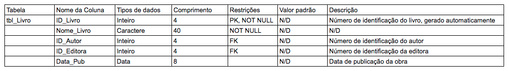

# Banco de dados Relacional

## Dados x Informação

### Dados
Dados são fatos em uma forma primária, que podem ser armazenados em algum meio. Ex:
* CPF
* Nome
* Data

### Informação
Informação são os fatos organizados de maneira a produzir um significado, dados colocados em contexto. Ex:
* Lista de clientes com seus números de CPF, ordenados.

## Metadados
* Definimos Metadados como sendo "Dados sobre os dados"
* Permitem efetuar a representação e identificação dos dados, garantindo sua consistência e persistência
* Os Metadados são mantidos no Dicionário de Dados (ou em um Catálogo de Dados)

## Banco de dados
Um Banco de Dados (BD) é uma coleção organizada de dados. Esses dados são organizados de modo a modelar aspectos do mundo real, para que seja possível efetuar processamento que gere informações relevantes paraos usuários a partir desses dados.

Um BD é composto por diversos objetos, tais como: tabelas, esquemas, visões, consultas, relatórios, procedimentos, triggers, entre outros.

## SGBD
SGBD significa "sistema de gerenciamento de Banco de Dados"
* Um SGBD é uma coleção de softwares que permite aos usuários criarem e manterem um ou mais bancos de dados.
* São usados nas tarefas de definição, construção, manipulação e compartilhamento dos bancos de dados entre aplicações e usuários.
* Permitem proteger o banco de dados e mantê-lo ao longo do tempo.

## Modelo Relacional
* Neste modelo os dados são separados em entidades, conforme cada assunto, e registrados como atributos dessas entidades.
* As entidades se relacionam entre si e epermitem que os dados sejam armazenados e recuperados de forma rápida e segura.

## Modelos
* Um modelo é uma estrutura que ajuda a comunicar os conceitos que estão na mente do projetista. Podemos usá-los para tarefas como descrever, analisar, especificar e comunicar ideias.
* O modelo deve possuir detalhes suficientes para que um desenvolvedor construir o banco de dados de acordo com a necessidade do projeto.

## Modelagem de Dados
* Modelagem de Dados é o processo de criação de um Modelo de Dados para um sistema de informação, com a aplicação de técnicas específicas de modelagem.
* Trata-se de processos para definir e analisar requisitos de dados necessários para suportar processos de negócio com sistemas informatizados em organizações.
* Um modelo de dados fornece uma estrutura para os dados usados em um SI, com definições e formatos específicos.

## Componentes de um Banco de Dados Relacional
* Tabela: Estrutura básica de armazenamento no SGBDR. Armazena todos os dados necessários sobre algo do mundo real, como clientes, pedidos ou produtos. Também chamada de relação. Um banco de dados relacional pode conter uma ou mais tabelas.

* Tupla: Ou linha/registro, representa todos os dados requeridos por uma determinada ocorrência de entidade particular. Por exemplo, os dados de um cliente específico. Cada linha em uma tabela deve ser identificada por uma chave primária de modo a não haver duplicação de registros.

* Coluna: Unidade que armazena um tipo específico de dado (valor) - ou não armazena nada, com valor nulo. Esta é uma coluna não-chave, significando que seu valor pode se repetir em outras linhas da tabela.

* Relacionamento: Associação entre as entidades (tabelas), conectadas por chaves primárias e chaves estrangeiras.

* Chave primária: Coluna (atributo) que identifica um registro de forma exclusiva na tabela. Por exemplo, o CPF de um cliente, contendo um valor que não se repete na relação.

* Chave estrangeira: Coluna que define como as tabelas se relacionam umas com as outras. Uma Foreign Key (FK) se refere a uma Primary Key (PK) ou a uma chave única em outra tabela (ou na mesma tabela). Por exemplo, na tabela de pedidos podemos ter uma chave estrangeira efetuando o relacionamento com a chave primária na tabela de clientes.

* Índices, SP, Triggers

## Convenções para modelagem de entidades, relacionamento e atributos
* Entidades: Nome único, singular; em caixa alta;
* Atributos: Nome no singular; caixa baixa; atributos obrigatórios marcados com '*'; identificador único marcado com #;
* Relacionamentos: nome identificador (verbo); opcionalidade ("deve ser" ou "pode ser"); grau ou cardinalidade ("um e apenas um", ou "um ou mais")

[*Cardinalidade*](https://pt.wikipedia.org/wiki/Cardinalidade) significa que cada entidade pode ser ou deve em relação de forma uma e apenas uma ou mais com outra entidade.

## Modelagem de Dados - Níveis

### MCD - Modelo conceitual (alto nível)
Primeira fase da modelagem, onde o modelo é representado por meio de uma visão simplificada dos dados e seus relacionamentos. Com isso é possível determinar quais informações serão armazenadas no BD.

Exemplo: *Cadastro de Produtos em uma loja*
Dados necessários: Nome do produto, categoria do produto (limpeza, higiene, etc), código do fornecedor, tipo de embalagem, tamanho, quantidade.

### MLD - Modelo lógico
Esse modelo possui conceitos que os usuários são capazes de entender, ao mesmo tempo em que não está distante de um modelo físico do banco de dados.

### MFD - Modelo físico (baixo nível)
A partir de um modelo lógico, é possível criar o modelo físico, onde se detalham os componentes de estrutura física do banco de dados, incluindo as tabelas, campos, tipos de valores, restrições, etc.
Após se criar o modelo físico, pode-se implementar o banco de dados utilizando o SGBD mais adequado.

## Modelo Entidade-relacionamento e Diagrama ER

### Modelo Entidade-Relacionamento
Também conhecido pela sigla *MER*, trata-se de um modelo conceitual usado para descrever objetos envolvidos no domínio de um sistema a ser construído, incluindo seus atributos e relacionamentos.
O MER permite representar de forma abstrata a estrutura que irá construir o banco de dados.

É composto pelos seguintes objetos:
* Entidades
* Atributos
* Relacionamentos

#### MER
Um modelo entidade relacionamento é uuma maneira sistemática de descrever e definir um processo de negócio.
O processo é modelado como components (entidades) que são ligadas umas às outras por relacionamentos que indicam as dependências entre elas.
As entidades podem ter várias propriedades (atributos) que as caracterizam.
Diagramas são criados para representar graficamente entidades, atributos e relacionamentos, denominados *Diagramas Entidade-Relacionamento (DER)*.

#### Componentes do DER
Um *Diagrama Entidade Relacionamento* é uma representação gráfica associada ao MER (ou parte dele). Os componentes *Diagrama Entidade Relacionamento* são:

* Retângulos - Representam entidades
* Elipses - Representam atributos
* Losangos - Representam relacionamentos
* Linhas - Ligam atributos a entidades e entidades a relacionamentos

### O que são atributos?
Atributos descrevem características da entidade, como por exemplo: fabricante, modelo, cor, placa, etc.

Os atributos possuem um tipo de dados (domínio), nome e valor específico.

#### Tipos de atributos
Os atributos podem ser de vários tipos, tais como:
* Simples
* Composto
* Multivalorado
* Determinante
* Indentificador

Entre outros.

##### Atributo Simples/Atômico
Não possui características especiais e são indivisíveis.
Ex: Nome da empresa, CPF, CNPJ...

##### Atributo composto
É formado por itens menores; pode ser subdividido em outros atributos.
Ex: Endereço da empresa.

##### Atributo Multivalorado
Pode conter mais de um valor para um mesmo resgisto (informação).
Ex: Telefone da empresa.

##### Atributo Determinante
Define de forma única as instâcias de uma entidade.
Não podem existir duas instâncias com o mesmo valor nesse atributo.
Ex: CNPJ da empresa, Código de Produto

##### Atributos identificadores ("Chaves")
Uma *chave* identifica uma instância específica na classe de entidade.
Ex: CPF, CódigoProduto, Matricula, ID_Setor

As chaves podem ser únicas ou não únicas:
- Únicas: O valor dos dados da chave é único na entidade
- Não única: Usada para agrupar instâncias de classe em categorias

##### Exemplo de representação de entidades e atributos

## Entidade x Relação
Uma entidade é um conceito do mundo real, como por exemplo um Cliente ou um produto.
Uma relação é um conjunto de registros (tuplas) que representam um modelo de uma entidade.
Cada registro representa uma instância de entidade e o conjunto de todas as instâncias com seus atributos é chamado de relação.

### Relação
Tabela bidimensional com características específicas, composta por linhas e colunas, criada a partir de uma entidade.

Características de uma relação:
- Linhas contém dados sobre instâncias de uma entidade (registros)
- Colunas contém dados sobre atributos da entidade (campos)
- Cada célula da tabela armazena um único valor
- Todos os valores em uma coluna são do mesmo tipo (domínio)
- Cada coluna possui um nome único
- Não há duas linhas idênticas
- As relações geralmente geram tabelas no banco

> Toda Relação é uma Tabela, mas nem toda Tabela é uma Relação.

## Relacionamentos

### O que são Relacionamentos
As Entidades podem ser conectadas entre sim por meio de Relacionamentos. Trata-se de uma estrutura que indica a associação de elementos de uma ou mais entidades.

### Porque precisamento de Relacionamentos?
Como os dados de diferentes entidades estão armazenados em tabelas distintas, geralmente precisamos combinar duas ou mais tabelas para responder às perguntas específicas dos usuários.

Por exempli, podemos querer saber quais produtos, e em qual quantidade foram adquiridos por um cliente em particular. Precisaremos então de dados das tabelas de clientes, de pedidos e de produtos para obter essa informação.

### Representando Relacionamentos
Representamos um Relacionamento em um DER por meio de um losango, que conecta uma ou mais Entidades:

#### Relacionamento unário (recursivo)

#### Relacionamento binário

#### Relacionamento ternário

### Chaves
Uma chave consiste em uma ou mais colunas de uma relação cujos valores são usados para identificar de forma exclusiva uma linha ou conjunto de linha.
Pode ser única (identifica uma única linha) ou não única (identifica um conjunto de linhas).

* Únicas (Unique): Candidata, composta, Primária, Surrogada.
* Não-Única (Non-Unique): Estrangeira.

#### Chave Canditada
* Atributo ou grupo de atributos com o potencial para se tornarem uma chave primária
* Uma chave candidata que não seja usada como chave primária será conhecida como uma **Chave Alternativa**

Ex: Num_Matricula e CPF em uma tabela de registro de alunos.

#### Chave Primária
* Chave candidata escolhida para ser a **Chave Principal1** na relação.
* Identifica de forma **exclusiva** os registros em uma tabela, não podendo ter repetição de valores nem tampouco valor nulo.
* Primary Key/PK

#### Chave Estrangeira
* Coluna de uma tabela que estabelece um **Relacionamento com a Chave Primária** de outra tabela.
* É a partir da chave estrangeira (Foreign Key / FK) que sabemos com qual registro em outra tabela um registro está relacionado.

#### Chave Composta
* Chave que é composta de dois ou mais atributos (colunas).
* Geralmente empregada quando nao é possível utilizar uma única coluna de uma tabela para identificar de forma exclusiva seus registros.

#### Chave Surrogada / Substituta
* Valor numérico, única, adicionado a uma relação para servir como chave primária.
* Não possui significado para os usuários e geralmente fica escondida nas aplicações.
* As chaves substitutas são frequentemente usadas no lugar de uma chave primária composta.

### Cardinalidade
A cardiladidade diz respeito ao número de itens que se relacionam nas entidades.
A cardinalidade pode ser máxima ou mínima, significando respectivamente os números mínimo e máximo de instâncias de cada entidade associadas no relacionamento.

#### Simbologia para Cardinalidades

### Integridade de dados
Manutenção e garantia da consistência e precisão dos dados, sendo um aspecto crítico no design, implementação e uso de sistema de armazenamento de dados.
A integridade é atingida por meio da aplicação de **Restrições de Integridade**.

Valores inseridos em uma coluna devem sempre obedecer à definição dos valores que são permitidos para essa coluna - os valores do **domínio**.

Ex: em uma coluna que armazena preços de mercadorias, os valores admitidos são do domínio numérico - ou seja, apenas números.

#### Integridade de Domínio - Fatores
* Tipo de Dado do campo
* Representação interna do tipo de dado
* Presença ou não do dado
* Intervalos de valores no domínio
* Conjuntos de valores discretos

#### Integridade Referencial
Uma restrição de Integridade Referencial assegura que valores de uma coluna em uma tabela são validos baseados nos valores em uma outra tabela relacionada.

Ex: Se um produto de ID 523 foi cadastrado em uma tabela de Vendas, então um produto com ID 523 deve existir na tabela de Produtos relacionada.

#### Integridade de Vazio
Este tipo de integridade infrma se a coluna é obrigatória ou opcional - ou seja, se é possível não inserir um valor na coluna.
Uma coluna de chave primária, por exemplo, sempre deve ter dados inseridos, e nunca pode estar vazia, para nenhum registro.

### Dicionário de dados
Um dicionário de dados é um documento usado para armazenar informações sobre o conteúdo, formato e a estrutura de um banco de dados, assim como os relacionamentos entre os seus elementos.
É importante manter um dicionário de dados para limitar os erros ao criar a estrutura física do banco de dados no computador. Dicionário de dados também é chamado de **Repositório de Metadados**

#### Exemplo de Dicionário de Dados

### Normalização e Anomalias
