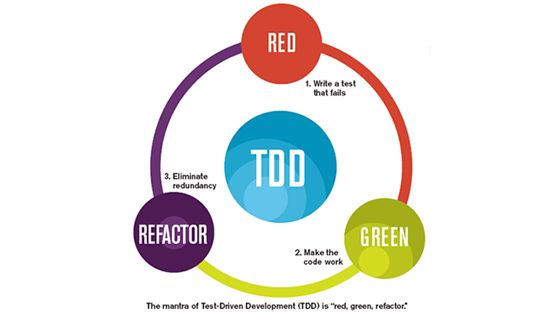

# Qualidade de software

## Operação
Um código com qualidade é aquele que tem:

1. Corretitude
  - _Ele faz o que foi pedido?_

2. Confiabilidade
  - _Ele é preciso?_

3. Eficiência
  - _Ele tem boa performance?_

4. Integridade
  - _Ele oferece segurança?_

5. Usabilidade
  - _Ele é fácil de usar?_

6. Adaptabilidade
  - _Ele se adapta as necessidades do usuário?_

### Transição

1. Portabilidade
  - _Consigo movê-lo facilmente?_

2. Reusabilidade
  - _Posso utilizar parte dele?_

3. Interoperabilidade
  - _Ele trabalha com outros softwares em conjunto?_

### Revisão

1. Manutenibilidade
  - _Fácil de corrigir?_

2. Flexibilidade
  - _Fácil de mudar?_

3. Testabilidade
  - _Posso testar o seu funcionamento?_

## Por que testar?

- Reduz o tempo gasto em análise e correção de bugs
- Facilita refatoração
- Gera documentação
- Melhora o design do código
- Garante que o trabalho tenha qualidade

## Como funciona o fluxo TDD?



1. Escrever o teste.  
2. Escrever o código para o teste passar - `dumb code`.  
3. Escrever um segundo caso de teste.  
4. Escrever o código que faça todos os testes passarem.  
5. Escrever um terceiro caso de teste (se necessário).
6. Refatorar o código

## Como pensar em testes?

- O que o código precisa fazer? (sempre pensando em pequenos métodos com responsabilidades únicas)
- Que dados ele recebe?
- Que dados ele precisa retornar?
- Que ações precisam acontecer para o código rodar?

### Padrão do teste

"Ele deve fazer isso quando aquilo"
"It should do that when this"

```js
it('should return 4 when receive 2,2') {
  expect(sum(2,2)).to.equal(4)
}
```

## Tipos de teste


### Teste unitário  

É um simples e pequeno teste automatizado que prova o comportamento de um único método.  

- Evite ruído entre os testes.
- Escolha os melhores assets para cada momento.
- Procure usar Mocks para chamadas externas.
- Ultilize dele para organizar o design de seu código.

### Teste de integração

É um teste para validar se os componentes estão funcionando em conjunto.

- Cuidado para não criar um teste inútil.
- Isole o máximo possível dos ambientes.

### Testes de aceitação (E2E)

O teste de aceitação é realizado com o propósito de avaliar a qualidade externa do produto e, na medida do possível, também a qualidade em uso.

- Valide apenas o fluxo de funcionamento do projeto.

## Spies, Stubs e Mocks

### Spies

Como o nome sugere, spies são usados para vigiar ingormações sobre chamadas de funções (métodos). Um Spy vai nos dizer se o método foi chamado, quantas vezes e quais argumentos foram passados.  

São muito úteis para testar callbacks e como métodos são usados dentro de um sistema. Os spies te permitem verificar se um outro método foi chamado dentro do método que você está testando.

```js
it('shoul inspect jQuery.getJSON\'s usage of jQuery.ajax', function () {
  sinon.spy(jQuery, "ajax")

  jQuery.getJSON('/some/resource')
  assert(jQuery.ajax.calledOnce)
})
```

### Stubs

Stubs são como spies, exceto por eles substituirem a função alvo. Podendo inclusive mudar o comportamento, assim como os valores e exceções levantadas.

Pode-se usar um Stub quando quiser controlar o comportamento de um teste, "pular" uma parte não necessária do código ou simplificar o teste de código assíncrono.

### Mocks

Mocks são métodos falsos (similares aos spies) com comportamento pré-programado (similar ao Stub) e respostas/expectatios pré-programados.

Mocks devem ser utilizados quando você precisa de um Stub, mas você precisa verificar múltiplos comportamentos em um específico ponto.

```js
it('should pass object with correct values to save only once', function() {
  const info = { name: 'test' }
  const expectedUser = { nameLowercase: info.name.toLowerCase() }

  const database = sinon.mock(Database)
  database.expects('save').once().withArgs(expectedUser)

  setupNewUser(info, function () { })
  database.verify()
  database.restore()
})
```
