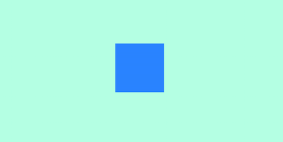

# Setup básico

Primeiro é necessário criar um arquivo de HTML e um de scripts. Usando um [CDN](https://pt.wikipedia.org/wiki/Content_Delivery_Network) para incluir o ThreeJS, o arquivo ficaria assim:

```html
<!DOCTYPE html>
<html lang="en">
<head>
  <meta charset="UTF-8">
  <meta name="viewport" content="width=device-width, initial-scale=1.0">
  <meta http-equiv="X-UA-Compatible" content="ie=edge">

  <title>ThreeJS</title>

  <link rel="stylesheet" href="https://cdnjs.cloudflare.com/ajax/libs/normalize/7.0.0/normalize.min.css">
  <script src="https://cdnjs.cloudflare.com/ajax/libs/three.js/85/three.js"></script>
</head>
<body>

<!-- Cria um elemento canvas para ser acessado posteriormente -->
<canvas id="my-canvas"></canvas>

<script src="scripts.js"></script>
</body>
</html>
```

Indo ao arquivo `scripts.js` criaremos um  `renderer`, onde o ThreeJS irá "desenhar" tudo

```js
// Intancia o renderer
const renderer = new THREE.WebGLRenderer({
  canvas: document.querySelector('#my-canvas'), // Define onde o canvas vai ser renderizado
  antialias: true                               // Ativa o antialias
})

renderer.setClearColor(0x00ff00)                        // Define a cor de background
renderer.setPixelRatio(window.devicePixelRatio)         // Define a taxa de pixels do canvas
renderer.setSize(window.innerWidth, window.innerHeight) // Define a largura e altura do canvas
```

Para que possamos renderizar objetos no nosso canvas, precisamos de uma "câmera",
uma câmera recebe 4 argumentos:

```js
// Instancia uma câmera
const camera = new THREE.PerspectiveCamera(
  35,                                     // Field of view => Campo de visão
  window.innerWidth / window.innerHeight, // Aspect ratio  => Aspecto
  0.1,                                    // Near          => Distância mínima de renderização
  2000                                    // Far           => Distância máxima de renderização
)
```

Por fim, precisamos insanciar uma cena e adicioná-la ao renderer:

```js
// Instancia uma cena
const scene = new THREE.Scene()

// Renderiza a cena
renderer.render(scene, camera)
```

Agora podemos ver uma tela verde ocupando toda a tela do browser, mas ainda
não temos nenhum objeto, portanto, vamos adicionar um cubo:

```js
// Os 3 primeiros parâmetros passados representam os lados do cubo
// Mais 3 parâmentros podem ser passados e que definirão o número de faces 
// em cada lado do cubo criado
const boxGeometry = new THREE.BoxGeometry(100 /* X */, 100 /* Y */, 100 /* Z */)

// Aqui criaremos um material para o cubo, o material mais básico
// é o MeshBasicMaterial, que renderiza cores solidas apenas
const boxMaterial = new THREE.MeshBasicMaterial( { color: 0x3299FF } )

// Agora criaremos nosso mesh (malha) passando como parâmetro
// a geometria e o material para o cubo
const boxMesh = new THREE.Mesh(boxGeometry, boxMaterial)

// Definindo em que lugar do espaço o nosso objeto ficará
boxMesh.position.set(0, 0, -800)
```

Por fim, podemos adicionar o objeto à cena:

```js
// Por fim, adicionaremos nosso objeto à cena
scene.add(boxMesh)

// Renderiza a cena
renderer.render(scene, camera)
```

Note que passandos a linha `renderer.render(scene, camera)` para o final do arquivo,
pois temos que renderizar apenas quando todos os objetos tiverem sido adicionados.

Pronto. Acabamos de cria a cena mais entediante do mundo, o fundo verde com um quadrado azul.



Porém, isso não é um quadrado, é um cubo, acontece é que estamos olhando pra ele de frente,
por isso vamos adicionar uma animação para que possamos ver todos os lados do cubo.

```js
function render() {
  requestAnimationFrame(render)  // Chama novamente a função render

  boxMesh.rotation.y += 0.01     // Faz o objeto girar no eixo Y
  boxMesh.rotation.z += 0.01     // Faz o objeto girar no eixo Z

  renderer.render(scene, camera) // Renderiza a cena
}

render()
```

Agora podemos ver um pouco melhor o nosso cubo.


Ainda pode ser melhorado, podemos adicionar luzes. Existem muitos tipos diferentes de luzes
e elas afeta, suas cenas de forma diferente, especialmente dependendo do tipo de material que
você estiver usando.

```js
const ambientLight = new THREE.AmbientLight(0xffffff /* Cor */, .5 /* Intensidade */)
scene.add(ambientLight) // Adicionando a luz ambient à cena

const pointLight = new THREE.PointLight(0xffffff /* Cor */, .5 /* Intensidade */)
scene.add(pointLight) // Adicionando um ponto de luz a cena
```

Como o nosso material básico não reage a luz, precisamos mudar o tipo de material que ele é construido.

```js
const boxMaterial = new THREE.MeshLambertMaterial( { color: 0x3299FF } )  // ==> Reage a luz
```

Com luz, nosso cubo fica assim:


Pronto. O código pode ser encontrado [aqui](./scripts.js)
