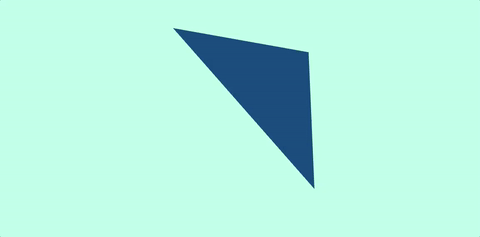
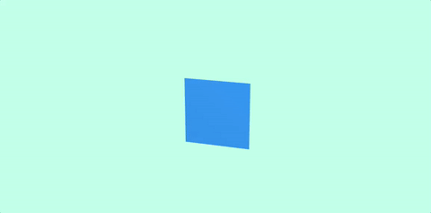
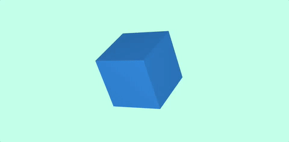
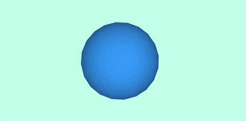
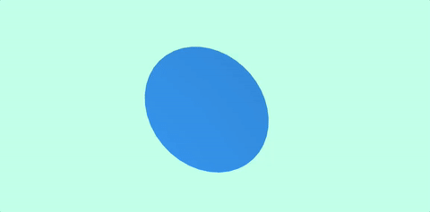
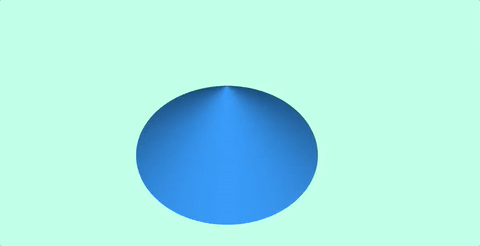
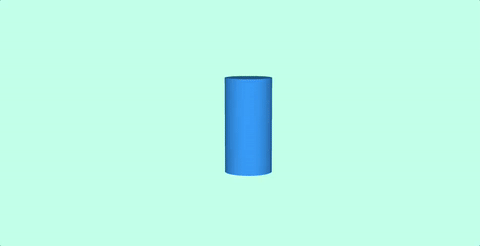
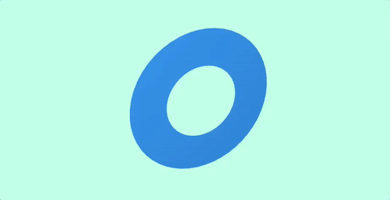
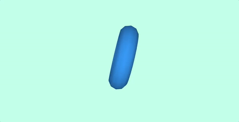
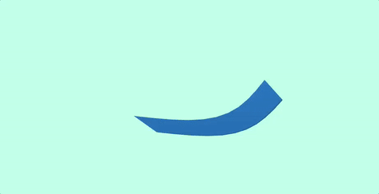

# Formas

Existem vários tipos de formas em ThreeJs. Começaremos com parte do [código anterior](../1.basic-setup). O código básico fica assim:

```js
/* ------------------------------------------------- */
// SETUP BÁSICO
/* ------------------------------------------------- */

const renderer = new THREE.WebGLRenderer({              // Intancia o renderer
  canvas: document.querySelector('#my-canvas'),         // Define onde o canvas vai ser renderizado
  antialias: true                                       // Ativa o antialias
})

renderer.setClearColor(0xBFFFE9)                        // Define a cor de background
renderer.setPixelRatio(window.devicePixelRatio)         // Define a taxa de pixels do canvas
renderer.setSize(window.innerWidth, window.innerHeight) // Define a largura e altura do canvas

/* ------------------------------------------------- */
// CENA
/* ------------------------------------------------- */
const scene = new THREE.Scene()

/* ------------------------------------------------- */
// CÂMERA
/* ------------------------------------------------- */
const camera = new THREE.PerspectiveCamera(
  35,                                       // Field of view => Campo de visão
  window.innerWidth / window.innerHeight,   // Aspect ratio  => Aspecto
  0.1,                                      // Near          => Distância mínima de renderização
  2000                                      // Far           => Distância máxima de renderização
)

/* ------------------------------------------------- */
// LUZ
/* ------------------------------------------------- */

const ambientLight = new THREE.AmbientLight(0xffffff /* Cor */, .5 /* Intensidade */)
const pointLight = new THREE.PointLight(0xffffff /* Cor */, .5 /* Intensidade */)

scene.add(ambientLight)  // Adicionando a luz ambient à cena
scene.add(pointLight)    // Adicionando um ponto de luz a cena

/* ------------------------------------------------- */
// CRIANDO OBJETOS
/* ------------------------------------------------- */

/********************************/
/* Nossos objetos ficarão aqui  */
/********************************/
const material = new THREE.MeshLambertMaterial( { color: 0x3299FF } )
const mesh = new THREE.Mesh(geometry, material)

mesh.position.set(0, 0, -800)
scene.add(mesh)

/* ------------------------------------------------- */
// ANIMANDO A CENA
/* ------------------------------------------------- */

function animate() {
  requestAnimationFrame(animate)  // Chama novamente a função render

  mesh.position.y += 0.01
  mesh.position.x += 0.01

  renderer.render(scene, camera) // Adiciona o a cena e a câmera ao renderer
}

animate()
```

Em ThreeJs existem dois tipos básicos de geometria, o primeiro é `THREE.Geometry()`:

```js
const geometry = new THREE.Geometry()

// Adicionando vértices ao array
geometry.vertices.push(
  new THREE.Vector3(-100 /* X */,  100 /* Y */, 0 /* Z */),
  new THREE.Vector3(-100 /* X */, -100 /* Y */, 0 /* Z */),
  new THREE.Vector3( 100 /* X */, -100 /* Y */, 0 /* Z */)
)

// Cria uma nova face usando as vértices [0, 1, 2]
const face = new THREE.Face3(0, 1, 2)

// Adiciona a face à array de faces
geometry.faces.push(face)
```



O outro tipo básico de geometria é a `THREE.BufferGeometry()`, que é mais otimizada para performance,
porém, menos dinamica.

```js
const geometry = new THREE.BufferGeometry()

const vertices = new Float32Array([
  -100.0, -100.0, 0.0,
   100.0, -100.0, 0.0,
   100.0,  100.0, 0.0
])

geometry.addAttribute('position', new THREE.BufferAttribute( vertices, 3 ))
```

Com isso, teremos o mesmo resultado da imagem acima.

## Formas primitivas

ThreeJS também vem com algumas formas geométricas primitivas como:

```js
// THREE.PlaneGeometry()
const geometry = new THREE.PlaneGeometry(100 /* Largura */, 100 /* Altura */)
```


```js
// THREE.BoxGeometry()
const geometry = new THREE.BoxGeometry(
  100 /* Tamanho em X */, 
  100 /* Tamanho em Y */,
  100 /* Tamanho em Z */,
  4, /* Segmentos em X */,
  4, /* Segmentos em Y */,
  4, /* Segmentos em Z */,
)
```


```js
// THREE.SphereGeometry()
const geometry = new THREE.SphereGeometry(100 /* Raio */, 20 /* Segmentos em largura */, 20 /* Segmentos em altura */)
```


```js
// THREE.CircleGeometry()
const geometry = new THREE.CircleGeometry(100 /* Raio */, 40 /* Segmentos */)
```


```js
// THREE.ConeGeometry()
const geometry = new THREE.ConeGeometry(100 /* Raio */, 100 /* Altura */, 100 /* Segmentos */)
```


```js
// THREE.CylinderGeometry()
const geometry = new THREE.CylinderGeometry(
  25 /* Raio superior */,
  25 /* Raio Inferior */,
  100 /* Altura */,
  100 /* Segmentos do raio */,
  100 /* Segmentos da altura */,
  false /* Se o cilindro vai ser aberto ou fechado */
)
```


```js
// THREE.RingGeometry()
const geometry = new THREE.RingGeometry(
  50 /* Raio interior */,
  100 /* Raio exterior */,
  50  /* Segmentos */
)
```


```js
// THREE.TorusGeometry()
const geometry = new THREE.TorusGeometry(
  50 /* Raio do torus */,
  20 /* Diametro do tubo */,
  10  /* Segmentos radiais */,
  20 /* Segmentos do tubo*/,
  Math.PI * 2 /* Angulo central (padrão é Math.PI * 2) */
)
```


```js
// THREE.ParametricGeometry()
const paraFn = function(u, v) {
  let x = -100 + 200 * u
  let y = 0
  let z = (Math.sin(u * Math.PI) + Math.sin(v * Math.PI)) * -60

  return new THREE.Vector3(x, y, z)
}

const geometry = new THREE.ParametricGeometry(paraFn, 10, 10)
```

