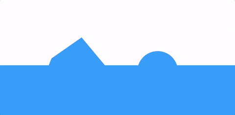
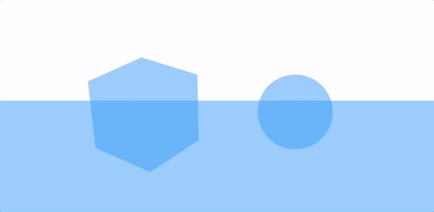
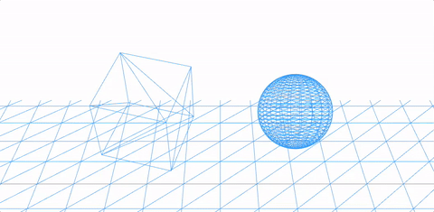
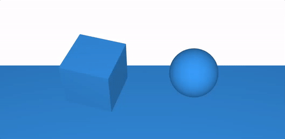
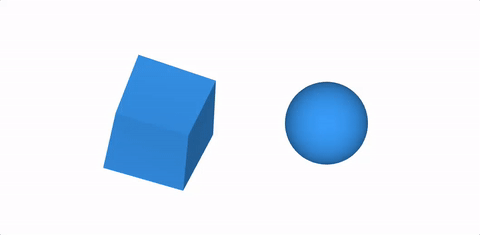
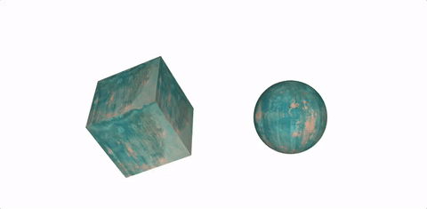
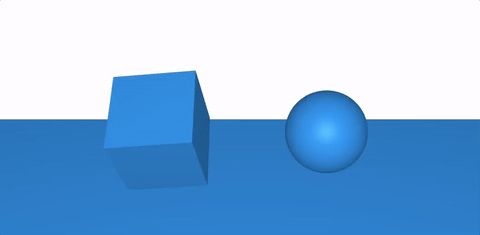
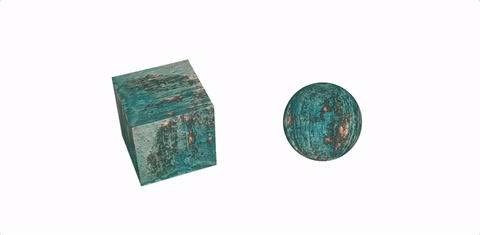

# Materiais

Existem vários tipos de materiais em ThreeJs. Começaremos com parte do [código anterior](../1.basic-setup). Teremos 3 objetos em cena, um cubo, uma esfera e uma geometria plana. O código básico fica assim:

```js
/* ------------------------------------------------- */
// SETUP BÁSICO
/* ------------------------------------------------- */
const renderer = new THREE.WebGLRenderer({              // Intancia o renderer
  canvas: document.querySelector('#my-canvas'),         // Define onde o canvas vai ser renderizado
  antialias: true                                       // Ativa o antialias
})

renderer.setClearColor(0xFFFFFF)                        // Define a cor de background
renderer.setPixelRatio(window.devicePixelRatio)         // Define a taxa de pixels do canvas
renderer.setSize(window.innerWidth, window.innerHeight) // Define a largura e altura do canvas

/* ------------------------------------------------- */
// CENA
/* ------------------------------------------------- */
const scene = new THREE.Scene()

/* ------------------------------------------------- */
// CÂMERA
/* ------------------------------------------------- */
const camera = new THREE.PerspectiveCamera(
  35,                                       // Field of view => Campo de visão
  window.innerWidth / window.innerHeight,   // Aspect ratio  => Proporção da tela
  0.1,                                      // Near          => Distância mínima de renderização
  2000                                      // Far           => Distância máxima de renderização
)

/* ------------------------------------------------- */
// LUZ
/* ------------------------------------------------- */

const ambientLight = new THREE.AmbientLight(0xffffff /* Cor */, .5 /* Intensidade */)
const pointLight = new THREE.PointLight(0xffffff /* Cor */, .5 /* Intensidade */)

scene.add(ambientLight)  // Adicionando a luz ambient à cena
scene.add(pointLight)    // Adicionando um ponto de luz a cena

/* ------------------------------------------------- */
// CRIANDO OBJETOS
/* ------------------------------------------------- */

// ====> Material

/*************************************/
/* Material dos objetos ficarão aqui */
/*************************************/

// ====> Geometria
const boxGeometry = new THREE.BoxGeometry(100, 100, 100)
const sphereGeometry = new THREE.SphereGeometry(50, 20, 20)
const planeGeometry = new THREE.PlaneGeometry(10000, 10000, 100, 100)

const boxMesh = new THREE.Mesh(boxGeometry, material)
const sphereMesh = new THREE.Mesh(sphereGeometry, material)
const planeMesh = new THREE.Mesh(planeGeometry, material)

// posicionamento da caixa
boxMesh.position.set(-100, 0, -800)
boxMesh.rotation.x += .20
boxMesh.rotation.y += .65

// posicionamento da esfera
sphereMesh.position.set(100, 0, -800)
sphereMesh.rotation.x += 0
sphereMesh.rotation.y += 0

// posicionamento do plano
planeMesh.position.set(0, -90, -1800)
planeMesh.rotation.x += -1
planeMesh.rotation.y += 0

// Adicionando a cena
scene.add(boxMesh)
scene.add(sphereMesh)
scene.add(planeMesh)

/* ------------------------------------------------- */
// ANIMANDO
/* ------------------------------------------------- */

function animate() {
  requestAnimationFrame(animate)  // Chama novamente a função render

  boxMesh.rotation.x += 0.01
  boxMesh.rotation.y += 0.01

  renderer.render(scene, camera) // Adiciona o a cena e a câmera ao renderer
}

animate()
```

## Basic Material

O tipo mais básico de material é o Basic Material, ele não responde a mudanças de luz, portanto o resultado fica assim:

```js
// ====> Material
const material = new THREE.MeshBasicMaterial( { color: 0x3299FF } )
```


### Transparência

Também é possível adicionar como propriedades a transparência do material:

```js
// ====> Material
const material = new THREE.MeshNormalMaterial( { 
  color: 0x3299FF,       // Cor da malha
  transparent: true,     // Ativar transparência
  opacity: .5            // Nível de opacidade
} )
```


### Wireframe
```js
// ====> Material
const material = new THREE.MeshBasicMaterial( { 
  color: 0x3299FF,       // Cor da malha
  wireframe: true        // Mostra apenas o esqueleto do objeto
} )
```


## Lambert Material

Esse material responde às mudanças de luz no ambiente:

```js
// ====> Material
const material = new THREE.MeshLambertMaterial( { 
  color: 0x3299FF,       // Cor da malha
} )
```


### Lado renderizado

Com Lambert Material também é possível definir qual lado será renderizado, o padrão é `side: THREE.FrontSide`, e também é possível mostrar a renderização apenas da parte traseira:

```js
// ====> Material
const material = new THREE.MeshLambertMaterial( { 
  color: 0x3299FF,        // Cor da malha
  side: THREE.BackSide    // Default
} )
```


### Texturas

É possível também aplicar texturas aos objetos:

```js
// ====> Material
const material = new THREE.MeshLambertMaterial( { 
  map: new THREE.TextureLoader().load('./texture.jpg')
} )
```


## Phong Material

Phong é outro material que responde a luz, porém é mais metalizado:

```js
// ====> Material
const material = new THREE.MeshPhongMaterial( {
  color: 0x3299FF,        // Cor da malha
} )
```


### Normal map

Phong aceitam `maps` e também `normalMap`:

```js
// ====> Material
const material = new THREE.MeshPhongMaterial( {
  map: new THREE.TextureLoader().load('./texture.jpg'),
  normalMap: new THREE.TextureLoader().load('./texture__normal-map.jpg')
} )
```


## Standard Material

Um novo tipo de material em ThreeJS é o `standard` material, ele combina o Lambert e o Phong em apenas um material.

```js
// ====> Material
const material = new THREE.MeshStandardMaterial( {
  color:  0x3299FF,
  roughness: .5,
  metalness: .5
} )
```

